# Flash Sale System

A high-concurrency flash sale system built with Go, PostgreSQL, and Docker. This system is designed to handle rapid spikes in traffic and ensure that product stock never goes below zero.

## Architecture Overview

The following sequence diagram illustrates how a purchase request travels through the layers, ensuring data integrity with pessimistic locking:

```mermaid
%%{init: {'theme': 'dark'}}%%
sequenceDiagram
    participant C as Client
    participant M as Middleware
    participant H as Handler
    participant S as Service Layer
    participant R as Repository Layer
    participant DB as PostgreSQL

    C->>M: POST /orders (Purchase)
    M->>M: Check Body Limit
    M->>H: Forward Request
    H->>H: Decode & Validate JSON
    H->>S: ProcessPurchase(productID, qty)
    
    rect rgb(50, 50, 50)
    Note over S, DB: Transaction Start
    S->>R: GetAvailableProductAndStockForUpdate
    R->>DB: SELECT ... FOR UPDATE (Pessimistic Lock)
    DB-->>R: Product & Stock Data
    R-->>S: return ProductStock
    
    alt Sufficient Stock
        S->>R: DecrementStock
        R->>DB: UPDATE inventory SET quantity = quantity - qty
        S->>R: CreateOrder
        R->>DB: INSERT INTO orders ...
        S->>S: Commit Transaction
        S-->>H: return OrderID
        H-->>C: 200 OK (Success)
    else Insufficient Stock
        S->>S: Rollback Transaction
        S-->>H: return ErrNotEnoughStock
        H-->>C: 400 Bad Request (Error)
    end
    end
```



## Prerequisites

Before running the application, ensure you have the following installed:

- **Go 1.22+**
- **Docker and Docker Compose**
- **Grafana k6** (for local load/spike testing)
- **Make** (standard on Linux/macOS)

### Windows Users
If you are using Windows, it is highly recommended to use **WSL (Windows Subsystem for Linux)** to run the `Makefile` and manage the Docker environment effectively.

## Environment Configuration

Copy the `.env.template` to a new file named `.env` and configure the following variables:

| Variable | Description | Default |
| :--- | :--- | :--- |
| `APP_PORT` | The port the application will listen on. | `8080` |
| `MAX_BODY_BYTES` | Maximum size of the request body in bytes. | `1048576` (1MB) |
| `DB_HOST` | Database host address. | `localhost` |
| `DB_PORT` | Database port. | `5432` |
| `DB_USER` | Database username. | `user` |
| `DB_PASS` | Database password. | `password` |
| `DB_NAME` | Database name. | `flashsale` |
| `DB_SSL_MODE` | PostgreSQL SSL mode (`disable`, `require`, etc.). | `disable` |
| `DB_MAX_OPEN_CONNS` | Maximum number of open connections to the database. | `100` |
| `DB_MAX_IDLE_CONNS` | Maximum number of idle connections in the pool. | `100` |
| `DB_CONN_MAX_LIFETIME` | Maximum amount of time a connection may be reused. | `30m` |
| `DB_CONN_MAX_IDLE_TIME` | Maximum amount of time a connection may be idle. | `5m` |

## API Response Structure

All API responses follow a consistent JSON format:

| Field | Type | Description |
| :--- | :--- | :--- |
| `message` | `string` | A human-readable message describing the result. |
| `data` | `any` | The actual payload of the response (e.g., product details, order ID). |
| `error` | `any` | Error details if the request failed (null on success). |

Example Success Response:
```json
{
  "message": "purchase successful",
  "data": {
    "order_id": "550e8400-e29b-41d4-a716-446655440000"
  }
}
```

Example Error Response:
```json
{
  "error": "not enough stock"
}
```

## How to Run

### Development Mode
To start the database and the application in development mode:
```bash
make dev
```
This will build and start the `db` and `app` services.

### Stop Services
To stop all running services and clean up:
```bash
make down
```

## Testing

### Unit Tests
To run unit tests for services, handlers, and utilities:
```bash
go test ./...
```

### Integration Tests
Integration tests run against a real database instance inside a Docker container. To execute them:
```bash
make test-integration
```
This command will spin up a dedicated test database, run the tests, and then tear down the containers.

## Spike & Load Testing

The system includes a spike test script to verify performance under high concurrency and ensure inventory integrity.

### Inventory Integrity & Concurrency Control
The system is designed to strictly prevent negative inventory (overselling) and double-spend scenario using **Pessimistic Locking (`SELECT FOR UPDATE`)**.

- **Pessimistic Locking**: When a purchase request is made, the system locks the specific product row in the database. This ensures that only one transaction can modify the stock at a time, preventing race conditions.
- **Error Handling**: If a user attempts to purchase a product that is out of stock or if the requested quantity exceeds the available stock, the API will return a **400 Bad Request** error with a message indicating "not enough stock".
- **High Traffic**: The system uses `SKIP LOCKED` or standard locking mechanisms to ensure that even under extreme load, the database remains consistent and no over-selling occurs.

### Running Spike Tests with k6

#### 1. Install k6
You must install **Grafana k6** on your local machine to run spike tests directly. Follow the [official installation guide](https://k6.io/docs/getting-started/installation/).

#### 2. Run via Docker (Benchmark)
You can run a complete benchmark (DB + App + k6) using the Makefile:
```bash
make benchmark
```

#### 3. Run Locally
If the application is already running (via `make dev`), you can run the spike test script manually:
```bash
k6 run loadtest/script.js
```

The spike test simulates a rapid ramp-up of users to verify:
- No over-selling of products.
- System stability under high load.
- Correct error handling (400) when stock is depleted.

## Project Structure
- `handler/`: HTTP handlers and routing.
- `service/`: Business logic and transaction management.
- `repository/`: Database interactions (SQL queries).
- `infrastructure/`: Database connection and configuration.
- `model/`: Data structures and API request/response definitions.
- `loadtest/`: k6 spike test scripts.
- `tests/`: Integration tests.

## Database Migrations

The database schema and initial data are managed automatically using Docker's initialization feature.

- **Automated Setup**: When you run `make dev` or `make benchmark`, the `migration/migrate-and-seed.sql` file is mounted to the `/docker-entrypoint-initdb.d/` directory of the PostgreSQL container.
- **Initialization**: PostgreSQL executes any `.sql` scripts in that directory upon the very first startup of the container.
- **Schema Details**: The migration script handles:
    - Creating necessary extensions (e.g., `pgcrypto` for UUIDs).
    - Defining custom types (e.g., `order_status` ENUM).
    - Setting up tables for `products`, `inventory`, and `orders`.
    - Creating triggers for automatic `updated_at` timestamps.
    - Adding indexes for performance optimization.

> **Note**: If you modify the `migrate-and-seed.sql` file and want the changes to reflect in an existing database, you must delete the volume or the container and restart it (e.g., `make clean && make dev`).

## Postman Collection

You can find the Postman collection for this project in the `postman-collection/` directory. You can download and import it into Postman to quickly test the API endpoints:

- [flash-sale.postman_collection.json](./postman-collection/flash-sale.postman_collection.json)